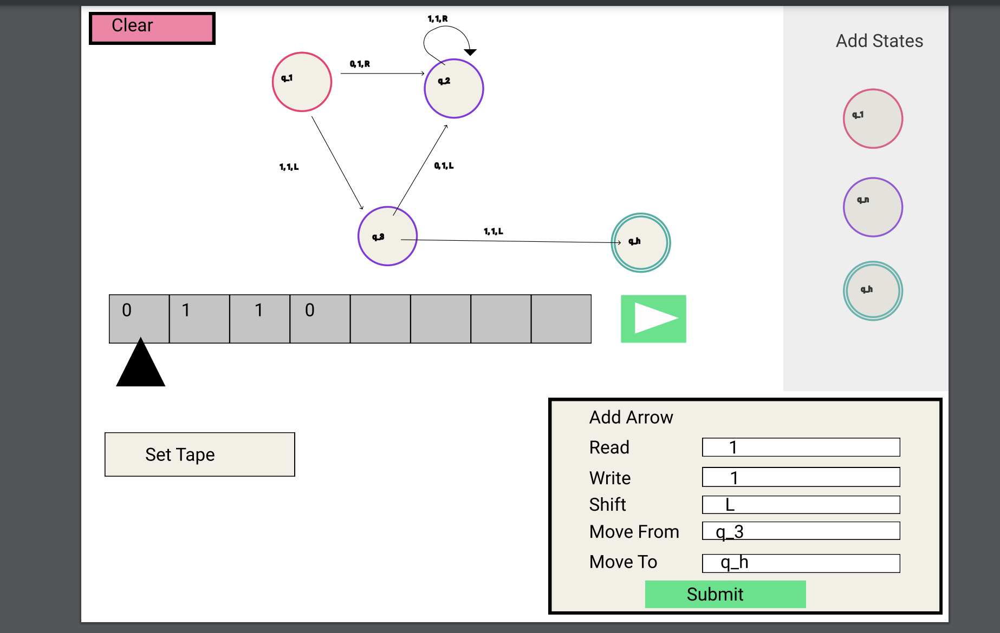

# Turing Machine Simulator #
<i>This goal of this project is to allow users to explore Turing Machines by creating their own
and seeing how they would work in practice. Users will be able to create a State Diagram representing the Turning Machine
and set the tape of the machine. After clicking go, the simulation will update the tape according to the rules entered 
in via the state diagram, moving the scanner along the tape as a Turning Machine would.</i>

### Tech Stack ###
Languages: C++  
Libraries: Cinder

## Background Knowlege ##
<i>I was inspired to do this project by my Computer Science and Philosophy intro course last semester. In the course, we 
explored many of the intersections between Computer Science and Philosophy, and Turing Machines especially interested me.
One of the resources I wished I had was a good Turing Machine simulator.</i>

### Some History ###
The Entscheidungsproblem is the problem of whether it is mathematically decidable whether or not an inference is valid.
There are 3 (main) approaches to the theory of what can be done "mechanically":
  1. Gödel's Recursive Functions
  2. Church's Lambda Calculus
  3. Turing's Turing Machines  

The Entscheidungsproblem was proposed by Hilbert and Ackerman in 1928 to create a procedure that decides in finitely many
operations the validity/logical soundness of a given logical expression. Gödel showed that such a procedure could never 
exist in via his Incompleteness Theorems. Gödel's work paved the way for Church and Turing. 

It is important to note that Turing Machines are entirely conceptual, they are not and were not intended to be
physical machines. Turing Machines consist of 2 parts: the tape and the scanner. The tape is divided into infinitely many
squares. The squares are either blank or contain a symbol of some finite alphabet. The scanner can (re)write and delete 
symbols as well as move 1 square to the left, 1 square to the right, or halt on the square. The behavior of the Turing Machine
at a given square on the tape is determined by 3 things:
  1. The symbol it reads
  2. The internal built-in instruction set
  3. The current state of the machine

Turing outlined mathematical problems that were not solvable by a Turing Machine. A famous one of these problems is the 
printing problem. In the printing problem, the idea is that there are some programs that will print a 0 at some point
during computation and others that will not. Turing concluded that a Turing Machine cannot decide which of these two 
categories a given program will fall under. 

### Notation, Assumptions, and Conventions ###
Turing Machines can be represented by State Diagrams as shown in the Figma Rendering below.

Complete configurations (or instantaneous descriptions) can also be used to represent Turing Machines. For example, if
the tape on the machine represented in the Figma Rendering read "0", the complete configuration would be:  
;q10;1q20;q111;q3011;q20111;q101111;1q21111;
11q2111;111q211;1111q21;11111q20;1111q111;111q3111;
11qh1111;

The notation that will be used in this simulation is as follows:  
  - Rules will be written as 'read, write, move'. For example, '-, 1, N' reads as "Read blank, Write 1, Do
  not move" and '0, 0, R' reads as "Read 0, Write 0, Move Right 1 Square".
  - **q1:** the starting state  
  - **qn:** the nth state  
  - **qh:** the halting state  
  - **L:** move the scanner 1 square to the left  
  - **R:** move the scanner 1 square to the right  
  - **N:** do not move the scanner  
  - **'-':** blank square

The simulation will follow the following conventions and assumptions:  
- The scanner will initially be placed at the 1st symbol of the user input
- The machine will start in q1
- There exist infinite blank squares to either side of the user input on the tape
- In displaying complete configurations, blanks will be displayed once they have been scanned at least one time

## Timeline ##
**Week 1**

- [ ] Read in the Turing Machine from users dragging and dropping in nodes (representing states of the machine) and 
  entering in rules for changing states(represented by arrows in the state diagram)
- [ ] Let users name non-starting/halting states
- [ ] Let users clear the simulation out
- [ ] Let users clear out individual nodes of the state diagram

**Week 2**
- [ ] Finish up Week 1
- [ ] Simulate the Turing Machine that the user has entered
  - [ ] Move scanner along the tape
  - [ ] Update the symbols on the tape according to the entered rules

**Week 3**
- [ ] Finish up Week 2
- [ ] Return the Complete Configuration of the Turing Machine for the given tape

**Stretch Goals**
- [ ] Animate the state diagram as the simulation is running (Highlight current state and raise arrows as their instructions 
      are executed)
- [ ] Let users drag and drop in arrows
- [ ] Let users pick where on the tape the scanner starts

## Figma Rendering ##

